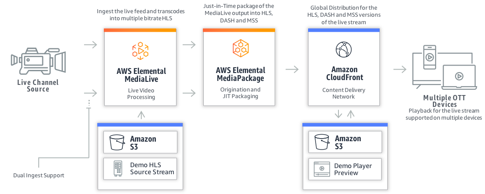

# Live Streaming on AWS

How to implement Live streaming on AWS  at scale leveraging AWS Elemental MediaLive,  MediaPackage and Amazon CloudFront. This repo contains the source code for the AWS solution [Live Streaming on AWS](https://aws.amazon.com/answers/media-entertainment/live-streaming/).


## On this Page
- [Architecture Overview](#architecture-overview)
- [Deployment](#deployment)
- [Source Code](#source-code)
- [Encoding Profiles](#encoding-profiles)
- [Creating a custom Build](#creating-a-custom-build)
- [Additional Resources](#additional-resources)


## Architecture Overview



**AWS Elemental MediaLive**<br/>
Is configured to ingest 2 live feeds and transcode the content into multiple adaptive bitrate HLS.  The solution can be configured to ingest RTP RTMP and HLS streams and will apply 1 of 3 encoding profiles which include bitrates of 1080p through 270p. The encoding profile is set at launch and is based on the source resolution (See Encoding Profiles below).

**AWS Elemental MediaPackage**<br/>
Ingests the MediaLive Output and package (JITP) the Live stream into HLS, DASH and MSS formats that are delivered through 3 MediaPackage custom endpoints.

**Amazon CloudFront**<br/>
Is configured with the three MediaPackage custom endpoints as the Origins for the distribution. CloudFront then enable the live stream content to be delivered globally and at scale.

**Optional Demo Deployment**<br/>
As part of the CloudFormation template a Demo HTML preview player is deployed to an Amazon S3 bucket which is a single page HTML/JavaScript application that will playback the HLS, DASH and MMS streams. In addition, the solution can be configured to ingest a Demo HLS feed hosted on AWS.   


## Deployment
The solution is deployed using a CloudFormation template with a lambda backed custom resource, available in both NodeJS and Python. For details on deploying the solution please see the details on the solution home page: [Live Streaming on AWS](https://aws.amazon.com/answers/media-entertainment/live-streaming/)


## Source code

**source/custom-resources-js::**<br/>
A NodeJS based  Lambda function used as a custom resource for deploying MediaLive and MediaPackage resources through CloudFormation.

**source/custom-resources-py::**<br/>
A Python based  Lambda function used as a custom resource for deploying MediaLive and MediaPackage resources through CloudFormation.

Please refer to [AWS Documentation](https://docs.aws.amazon.com/AWSCloudFormation/latest/UserGuide/template-custom-resources-lambda.html) for further details on Lambda-backed Custom Resources.

**source/console::**<br/>
A single page application used to demo playback of the live stream. This is deployed to an AWS S3 bucket as part of the CloudFormation deployment.


## Encoding Profiles
To solution Configures AWS Elemental MediaLive with one of three encoding profiles based on the source resolution defined at launch as a CloudFormation parameter:

**1080p Profile::**<br/>
1080p@6500kbps, 720p@5000kbps, 720p@3300kbps, 540p@2000kbps, 432p@1200kbps, 360p@800kbps, 270@400kbps, 234p@200kbps.

**720p Profile::**<br/>
720p@5000kbps, 720p@3300kbps, 540p@2000kbps, 432p@1200kbps, 360p@800kbps, 270@400kbps, 234p@200kbps.

**540p Profile::**<br/>
 540p@2000kbps, 432p@1200kbps, 360p@800kbps, 270@400kbps, 234p@200kbps.

To change the encoding settings update or replace the JSON files, update the medialive source code if required and then deploy the new code, instructions bellow. The code and JSON files can be found in:
```
  source/custom-resource-js/lib/medialive/index.js
  source/custom-resource-js/lib/medialive/encoding-profiles/medialive-1080p.json
  source/custom-resource-js/lib/medialive/encoding-profiles/medialive-720p.json
  source/custom-resource-js/lib/medialive/encoding-profiles/medialive-540p.json

  source/custom-resource-py/medialive.py
  source/custom-resource-py/encoding-profiles/medialive-1080p.json
  source/custom-resource-py/encoding-profiles/medialive-720p.json
  source/custom-resource-py/encoding-profiles/medialive-540p.json
```


## Creating a custom Build
The solution can be deployed through the CloudFormation template available on the solution home page: [Live Streaming on AWS](https://aws.amazon.com/answers/media-entertainment/live-streaming/).
 To make changes to the solution, download or clone this repo, update the source code and then run the deployment/build-s3-dist.sh script to deploy the updated Lambda code to an S3 bucket in your account.

### Pre-requirements:
* [AWS Command Line Interface](https://aws.amazon.com/cli/)
* Node.js 8.x or Python 3.x

### 1. Create an Amazon S3 Bucket.
The CloudFormation template is configured to pull the Lambda deployment packages from Amazon S3 bucket in the region the template is being launched in. Create a bucket in the desired region with the region name appended to the name of the bucket. eg: for us-east-1 create a bucket named: ```bucket-us-east-1```

### 2. Create the deployment packages:
Run the build-s3-dist.sh script, passing in 2 variables:
* CODEBUCKET = the name of the S3 bucket (do NOT include the -region extension)
* CODEVERSION = this will be the subfolder containing the code (live-streaming-on-aws/*codeversion*).

This will:
* copy the console files to ./deployment/dist/.
* copy the CloudFormation template to ./deployment/dist/ and updates the source code mappings.
* zip and copy the source code to ./deployment/dist/

Example:
```
  cd deployment/
  ./build-s3-dist.sh bucket 1.01
```
 This will deploy the source code to:
```
  s3://bucket-us-east-1/live-streaming-on-aws/1.01/.
```
And update the CloudFormation template mappings:
```
  SourceCode:
    General:
      S3Bucket: bucket
      KeyPrefix: live-streaming-on-aws/1.01
```

### 3. Upload the Code to Amazon S3.

Use the AWS CLI to sync the lambda code and demo console files to amazon S3:

 ```
   cd deployment/
   aws s3 sync .dist/ s3://bucket-us-east-1/live-streaming-on-aws/1.01/.
 ```

### 4. Launch the CloudFormation template.

Launch the updated CloudFormation template from ```deployment/dist/``` folder.


## Additional Resources

### Services
- [AWS Elemental MediaLive](https://aws.amazon.com/medialive/)
- [AWS Elemental MediaPackage](https://aws.amazon.com/mediapackage/)
- [AWS Elemental MediaPackage](https://aws.amazon.com/mediatailor/)
- [Amazon CloudFront](https://aws.amazon.com/cloudfront/)
- [OTT Workflows](https://www.elemental.com/applications/ott-workflows)

### Other Solutions and Demos
- [Video On Demand On AWS](https://aws.amazon.com/answers/media-entertainment/video-on-demand-on-aws/)
- [Media Analysis Solution](https://aws.amazon.com/answers/media-entertainment/media-analysis-solution/)
- [Live Streaming and Live to VOD Workshop](https://github.com/awslabs/speke-reference-server)
- [Live to VOD with Machine Learning](https://github.com/aws-samples/aws-elemental-instant-video-highlights)
- [Demo SPEKE Reference Server](https://github.com/awslabs/speke-reference-server)


***

Copyright 2018 Amazon.com, Inc. or its affiliates. All Rights Reserved.

Licensed under the Amazon Software License (the "License"). You may not use this file except in compliance with the License. A copy of the License is located at

    http://aws.amazon.com/asl/

or in the "license" file accompanying this file. This file is distributed on an "AS IS" BASIS, WITHOUT WARRANTIES OR CONDITIONS OF ANY KIND, express or implied. See the License for the specific language governing permissions and limitations under the License.
